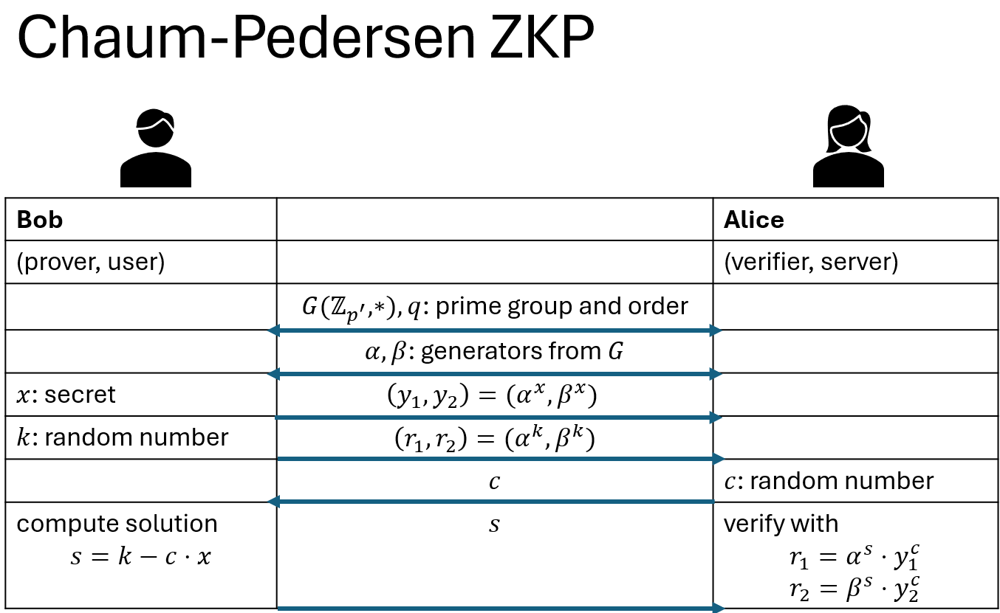

# Zero Knowledge Proofs in Rust

## 1. Course Description
### 1. Course Description
* outline of chapters
    1. theoretical background
        * Chaum-Pedersen Protocol: interactive protocol
    2. practical implementation
        * Rust, crates, and tests
    3. develop a server/client
        * `gRPC` is a modern open source high performance Remote Procedure Call (RPC) framework
        * real-world application
    4. dockerization

### 2. Introduction to Modular Arithmetics
* the **modulo operation** returns the remainder or signed remainder of a division 
* such that the result of the division may be expressed in two parts: $c, r$ 
* the dividend can be reconstructed by $c \cdot \text{ divisor } + r$
* examples:
    * $4 ÷ 2 = 0, r=0$
    * $3 ÷ 2 = 1.5$ or $c=1, r=1$
    * inversely, $c \cdot 2 + r = 3$
* the remained is equal or greater than zero 
    * $1+0 \text{ mod } 2 = 1$
    * $1+1 \text{ mod } 2 = 0$
    * $1+2 \text{ mod } 2 = 1$
    * $1+3 \text{ mod } 2 = 0$
    * $1+4 \text{ mod } 2 = 1$
    * $1+5 \text{ mod } 2 = 0$
    * $1+(a) \text{ mod } 2 = \{0, 1\}$
    * modulo remained repeats cyclically
* modulo for negative number
    * $-1 \text{ mod } 2 = 1$
    * $-2 \text{ mod } 13 = 11$

### 3. Quiz 1: Modular Arithmetics
* Q1: $34 \text{ mod } 11$
    * $r=1$ because $34=11 * 3 + 1$
* Q2: $3 \text{ mod } 4$
    * $r=3$ because $3=4 * 0 + 3$
* Q3: $4-7 \text{ mod } 2 $
    * $-3 \text{ mod } 2$
    * $c=-2, r=1$ because $-3=-2 * 2 + 1$
* Q4: $4-7 \text{ mod } 11 $
    * $-3 \text{ mod } 11$
    * $c=11,r=8$ because $-3=-1 * 11 + 8$

### 4. Groups
Introduction
* in mathematics, groups $G$ are a set of elements plus an operation $\circ$
* the operation associates an element of the set the other elements in the set
    * e.g. $\set{-1,0,1}$ and operator $+$
* any group must satisfy 4 properties

1. **Closure**
    * for any $a, b \in G$, then the operation of a by b must also belong to the group $a \circ b \in G$
2. **Associativity**
    * for any three elements $a, b, c \in G$, it must follow that $(a \circ b) \circ c = a \circ (b \circ c)$
3. **Identity**
    * there exists an element $i \in G$ such that for every $a \in G$, one has $a \circ i = a$ and $i \circ a = a$ 
    * this element is unique, aka as _neutral element_ or _identity element_
    * for natural numbers it's $0$
4. **Inverse**
    * for every $a \in G$, there exists an inverse element $a^{-1} \in G$  and $a^{-1} \circ a = i$
5. **Commutativity**
    * is not required, but groups that fulfill this are called _abelian group_
    * means that for every $a, b \in G$, the condition $a \circ b = b \circ a$

Example
* define a module group as set of natural numbers and an operation
    * $k=5$
    * set: $\mathbb{Z_5} = \set{0, 1, 2, 3, 4}$
    * operation: $a+b\text{ mod }5$
* test for all properties
* 1 closure:
    * $1 + 3 \text{ mod }5 = 4$
    * $4 \in \mathbb{Z_5}$
* 2 associativity:
    * $((a+b)\text{ mod }5 +c) \text{ mod }5 = a(+b+c)\text{ mod }5$
    * $a=2, b=3, c=4$
    * $((a+b)\text{ mod }5 +c) \text{ mod }5 = 4$
    * $a(+b+c)\text{ mod }5 = 4$
    * $4 = 4$ and $4 \in \mathbb{Z_5}$
* 3 identity is $0$
    * $i=0,a=2$
    * $2 + 0\text{ mod }5 = 2$
    * $0 + 2\text{ mod }5 = 2$
* 4 inverse
    * $0 + 0 \text{ mod }5 = 0$
    * $1 + 4 \text{ mod }5 = 0$
    * $2 + 3 \text{ mod }5 = 0$
    * $3 + 4 \text{ mod }5 = 0$
    * $4 + 1 \text{ mod }5 = 0$
* 5 commutativity
    * see 4

### 6. Generators
What are generators in Python?
* in Python, generators are functions that return an iterator that produces a sequence of values when iterated over
* the sequence of values does not yet exists in memory but each value is created once called from the iterator
* generators are useful when we want to operate on a large sequence of values or objects but we don't want to store them in memory all at once

Generator in Groups
* example modulo group 
    * $k=11$
    * set: $\mathbb{Z_{11}} = \set{1,2,...,10}$
    * operation $a \times b \text{ mod } 11$
    * the order of the set is the number of elements in the set $\text{ord}(\mathbb{Z_{11}})=10$ (can also be expressed as $|\mathbb{Z_{11}}|=10$)
* in python:
    ```python
    k = 11
    group = range(1, k)
    a = 2

    def operation(a, b, k):
        return a**b % k
        
    closure_a = [operation(a, b, k) for b in group]


    print(f"group = {set(group)}")
    print(f"closure_a = {set(closure_a)}")
    ```
    * result
    ```
    group = {1, 2, 3, 4, 5, 6, 7, 8, 9, 10}
    closure_a = {1, 2, 3, 4, 5, 6, 7, 8, 9, 10}
    ```
* $a$ is generator because it operating on it produced all elements in the group 

Elements that are **not** Generators
* let's do $c=3$ in the code above
    ```python
    c = 3
    closure_c = [operation(c, b, k) for b in group]
    print(f"closure_c = {set(closure_c)}")
    ```
    * result
    ```
    closure_c = {1, 3, 4, 5, 9}
    ```
* this returns an incomplete set of the group
    * $c=3$ is not a generator

Summary
> a generator is an element that if operated upon by other elements of the group can re-produce the entire group as result 

### 7. Discrete Logarithm Problem
* is at the foundation on many crypto-graphic concepts
* we'll discuss this with an informal approach
* let define our group
    * $G$ is a group with operator $\circ$
    * $\alpha \in G$ is a generator
    * $d$ is an integer
    * $\beta \in G$ 
    * problem: how many times $d$ must $\alpha$ be operated on itself to produce $beta$ ?
    * $\beta = \alpha \circ ... \circ \alpha = \alpha^{d}$
* in integer arithmatic, this relatively easy and can be solved with a logarithm
    * $8 = 2^x$ -> solve for $x$
    * $\log_2(8)=x$
    * $x=3$
* in modular arithmatic, this is a difficult problem
    * finding $d$ from $\alpha, \beta$ cannot be solved in non-polynomial time
    * but verifying $\beta$ from $\alpha, d$ is very easy
* this is good for proof-based cryptography because prohibitively  expensive computing power must be spent to solve it

Public-Private Key Cryptography
* the public key and private key work together to ensure the security of the exchanged data
* message gets encrypted by a public key (available to everyone), but can only be decrypted with its unique private key (only available to its owner)
* let's assume that
    * $\beta$ is the public key
    * $d$ is the private key
* if we pass $\alpha, \beta$ as meta-data to a 2nd party
    * then if $d$ is known, the message  can be decrypted easy and fast
    * but if $d$ is unknown, it must be expensively computed from $\alpha, \beta$
* with very large numbers, like `256-bit` integers, it becomes impossible for a machine to solve this in a human lifetime

### 8. Chaum-Pedersen ZKP Protocol
Overview
* this is an important theoratical and practical foundation for ZKP
* many cryptographic number groups use  a set of prime numbers with the operation of multiplication and modulo
* for our implementation, we use
    * set: $G=\set{\mathbb{Z_{p'}}}$
    * operation: $*$, which means $\alpha^d \text{ mod } p'$
    * the order $q$ is also a prime (prime order)
    * with prime order, any number in the set is a generator
    * elements $\alpha, \beta \in G$ are generators

Diagram
<p align="left">

</p>     

Motivation behind Zero Knowledge Proof
* we have two actors
    1. Bob (prover; has secret, private key; wants to log-in)
    2. Alice (verifier; has server)
* traditionally, Alice and Bob would have shared the private key and both know it
    * through previous account setup and encrypted message
* but for Alice, centrally holding the private keys of all users carries increased risk
* with ZKP, Alice wants to know if Bob has the private key without knowing the secret herself
    * instead Alice will send a challenge/task to Bob that he needs to solve in order to proof he has the private key

Designing the Protocol
* $\alpha, \beta, q$ are public info, known between the two actors
* Bob has the secret key $x$
* Bob is going to compute two numbers $y_1, y_2$ using $\alpha^x, \beta^x$ and sends them
* Bob generates a random number $k$ and repeats the previous step
* he computes $r_1, r_2$ using $\alpha^k, \beta^k$ and sends them
* this is enough info for Alice to create a challenge
* Alice generates a random number $c$ and sends it back
* Bob has to compute the solution $s$ for the challenge with $s = k - c \cdot \text{ mod } q$
* Bob sends this solution back to Alice
* Alice can verify this solution with
    * $r_1 = \alpha^s \cdot y_1^c$
    * $r_2 = \beta^s \cdot y_1^c$
    * this verification is computationally easy
* with `256-bit` numbers from a secure group $G$ it highly probable that Bob knows the private key

Proof
* for $r_1$ we have $\\
    r_1 = \alpha^s \cdot y_1^c \\
    y_1 = \alpha^x  \\
    s = k - c \cdot x \text{ mod } q
    $
* so we can substitute $\\
    r_1 = \alpha^{k-c x} \cdot \alpha^{c x} \\
    r_1 = \alpha^k \cdot \alpha^{c x} \cdot \alpha^{-c x} \\
    r_1 = \alpha^k
    $ 
* proof that $r_1 = \alpha^k$ is satisfied

Exercise
* for $r_2$ we have $\\
    r_2 = \beta^s \cdot y_1^c \\
    y_2 = \beta^x
    s = k - c \cdot x \text{ mod } q
    $
* so we can substitute $\\
    r_2 = \beta^{k-c x} \cdot \beta^{c x} \\
    r_2 = \beta^k \cdot \beta^{c x} \cdot \beta^{-c x} \\
    r_2 = \beta^k
    $
* proof that $r_2 = \beta^k$ is satisfied 

Review
* $\alpha, \beta, p', q$ are shared between actors
* the user has a secret $x$
* the user sends 2 tuples of data to the server
* the server creates a challenge and sends it to the user
* the user solves the challenge which is easy, if he knows the secret but near-impossible if unknown
* the server can verify the solution easily

### 9. Quiz 2: Chaum-Pedersen ZKP Protocol
* Q1: What is known to both prover (client) and verifier (server) in the Chaum-Pedersen ZKP protocol?
    * the constants variables $g, h$ (group order)
* Q2: What is the secret $x$?
    * a large integer
* Q3: What are $k, c$?
    * random numbers generated by client & server, respectively
* Q4: Is it secure to re-use $k, c$ everytime?
    * no, it would make the protocol insecure

### 10. Toy Example
Setup
* let's build a toy example from the concepts of the last lecture
* group of $\mathbb{Z_{23}}$ and order $q=11$ (n of elements)
    * all elements are generators
    * there are theorems to determine sets with all elements as generator (not covered here)
* our generators are $\alpha=4$ and $\beta=9$

Bob
* secret is $x=6$
* computes $y_1, y_2$
    * $y_1 = \alpha^x = 4^6 \text{ mod } 23 = 2$
    * $y_2 = \beta^x = 9^6 \text{ mod } 23 = 3$
* the random is $k=7$
* computes $r_1, r_2$
    * $r_1 = \alpha^k = 4^7 \text{ mod } 23 = 8$
    * $r_2 = \beta^k = 9^7 \text{ mod } 23 = 4$
* send $y_1, y_2$ and $r_1, r_2$ to Alice

Alice
* the random is $c=4$

Bob
* computes the solution $s=(k-c \cdot x) \text{ mod } q$
    * $s = (7 - 4 * 6)\text{ mod } 11$
    * $s = 5$

Alice
* verifies the solution with the previous infos
* verify $r_1$
    * $r_1 = \alpha^s \cdot y_1^c$
    * $r_1 = 4^5 \cdot 2^4 \text{ mod } 23$
    * $r_1 = 8$ ☑
* verify $r_2$
    * $r_2 = \beta^s \cdot y_1^c$
    * $r_2 = 9^5 \cdot 3^4 \text{ mod } 23$
    * $r_2 = 4$ ☑
* Bob can be verified

### 11. Assignment: Importance of Good Random Number Generators
**Tasks**
* We have seen that the protocol requires to use random number from both sides: prover (client) and verifier (server).
* Prove that the verifier can obtain the secret $x$ if the prover reuses the same random number k twice when the prover sends him two different challenges $c_1$ and $c_2$

Questions for this assignment
* Q1 Suppose the following:
    * 1. A prover selects "x" and "k" and the verifier generates a challenge "c1". The prover solves the challenge and sends "s_1" to the verifier.
    * 2. After one day the prover still has "x" as secrets and decides to reuse "k". After that, the verifier sends a new challenge "c2" to the prover nd this last returns the new solution "s_2".
    * What is bad with this?
* Q2: Now imagine if the prover uses a very bad random number generator for obtaining "k" and the "k" lies every time in a small group of 1000 elements.
    * What can an attacker easily do?

**Solutions**

T1
* when the prover reuses the same random number $k$ for two different challenges, $c_1$​ and $c_2$​, the verifier can obtain the prover's secret $x$
* prover sends the solution to the challenge as:
    * $s_1=k−c_1⋅x \text{ mod } q$ for the first challenge and
    * $s_2​=k−c_2​⋅x \text{ mod } q$ for the second challenge
* subtracting these two equations, the verifier can eliminate $k$ and isolate $x$:
    * $s_1−s_2=(k−c_1⋅x)−(k−c_2⋅x) \text{ mod } q$
* simplifying this expression
    * $s_1−s_2=−c_1⋅x+c_2⋅x \text{ mod } q$
    * $s_1-s_2=(c_2-c_1)⋅x \text{ mod } q$
* verifier now knows both $s_1−s_2$​ and $c_2−c_1$, and since $q$ is prime, $c_2−c_1$​ is invertible modulo $q$
* the verifier can compute:
    * $x=\frac{s_1−s_2}{c_2−c_1} \text{ mod } q $
* by reusing the same $k$, the prover compromises the secrecy of $x$, allowing the verifier to deduce the secret key

T2
* if the random number generator (RNG) produces $k$ from small set of 1000 elements, it significantly weakens the security of the protocol 
* 1: brute force attacks:
    * with only 1000 possible elements for $k$, an attacker can simply try all possible $k$ to break the protocol
    * the attacker intercepts $r_1 = \alpha^k$ (or $r_2 = \beta^k$) sent by the prover
    * since the set of $k$ is small, the attacker can compute $\alpha^k \text{ mod } p'$ (or $\beta^k \text{ mod } p'$) for all 1000 values of $k$ and compare these with $r_1$ (or $r_2$)
    * then the attacker can find the correct $k$
* 2: once $k$ is known:
    * if the attacker has deduced $k$, they can easily solve for $x$ using the challenge-solution pair ($c, s$)
    * from the solution $s$, the secret $x$ can be computed as $x = \frac{k-s}{c}$
    * since $k$ is known and ($c, s$) are provided during the protocol, the attacer can compute $x$, breaking the security
* thus, a small set for $k$ makes the protocol vulnerable as it can be found through brute-force, leading to the compromise of the secret $x$


## 2. ZKP Protocol in Rust
### 1. Install Rust
Installation 
* follow this guide for installation on your system: https://www.rust-lang.org/tools/install
* do these steps to test a successful installation: https://doc.rust-lang.org/book/ch01-01-installation.html

Create a Rust Project
* Rust comes with its own build- and package-manager called `cargo`
* create a new project with the command
    ```
    cargo init zkp-chaum-pedersen
    ``` 

### 2. Design Schema
Overview
* before we start coding, let's think about the necessary features for our project
* roles
    * prover (client)
    * verifier (server)
* functions
    * exponentiate with modulo (used several times by prover)
    * solve challenge
    * verify challenge
    * generate random number
* data type
    * big integer

### 3. Coding Exponentiate, Solve & Verify
* to handle big integers beyond the standard library support, we can use `num-bigint`
    ```toml
    [dependencies]
    num-bigint = { version = "0.4", features = ["rand"]}
    ```
    * this also comes with a RNG feature, which is useful for us
* now, we can implement:
    * `exponentiate`
    * `solve`
    * `verify`
* these functions (particularly, `solve`) can run into the integer over- or under-flow problem
    * this means the integer is too high or too low to be captured in memory for this given data type

### 4. Unit Test: Toy Example
Exercise
* using the example chapter 1 section 10, build a unit test that for three functions
* run the tests with
    ```
    cargo test --lib
    ```

### 5. Random Number Generator (RNG)
Overview
* for the protocol to be secure, we need very large integers that are randomly chosen
* there are special crates with cryptographically secure generation, but for learning purposes, we'll be using the `rand` crate
    ```toml
    [dependencies]
    rand = "0.8"
    ```
    * this integrates with `num_bigint` crate from before 
* this implementation is easy, but we also need to extend the unit tests
    * this time generate the random numbers $k, c$ with the new function
    * the example results will no longer work, but the verification must remain valid

### 6. Refactoring: Add a ZKP struct
Refactoring
* now we have the mathematical groundwork laid out in code
* for better readability and usability, let's refactor the code
    * add a struct `ZKP` that holds the public parameters of the protocol
    * move the function into methods of the `ZKP` struct 
* remember that refactoring the code also requires refactoring the tests 

### 7. 1024-bit Unit Test
Cryptographic Standards
* we already learned that the application is not secure with small integers
* for cryptographic security, we want groups that have certain attributes beyond large-ness
    * the order is a prime number
    * every element is a generator
    * etc.
* **Diffie-Hellman groups** have such attributes and used in cryptographic standards
    * link to [info on Diffue-Hellman Groups](https://www.rfc-editor.org/rfc/rfc5114)
    > This document describes eight Diffie-Hellman groups that can be used in conjunction with IETF protocols to provide security for Internet communications.
    > The groups allow implementers to use the same groups with a variety of security protocols, e.g., SMIME, Secure SHell (SSH), Transport Layer Security (TLS), and Internet Key Exchange (IKE).
    >
    > All of these groups comply in form and structure with relevant standards from ISO, ANSI, NIST, and the IEEE.
    > These groups are compatible with all IETF standards that make use of Diffie-Hellman or Elliptic Curve Diffie-Hellman cryptography.
* from this standard document, we can take the constants that define the public parameters for our ZKP-protocol
    * all values are given in hexa-decimal

1024-bit Group Constants
* value of the prime $p$ is:
    ```
    p = B10B8F96 A080E01D DE92DE5E AE5D54EC 52C99FBC FB06A3C6
        9A6A9DCA 52D23B61 6073E286 75A23D18 9838EF1E 2EE652C0
        13ECB4AE A9061123 24975C3C D49B83BF ACCBDD7D 90C4BD70
        98488E9C 219A7372 4EFFD6FA E5644738 FAA31A4F F55BCCC0
        A151AF5F 0DC8B4BD 45BF37DF 365C1A65 E68CFDA7 6D4DA708
        DF1FB2BC 2E4A4371
    ```
* value of the generator $g$ is:
    ```
    g = A4D1CBD5 C3FD3412 6765A442 EFB99905 F8104DD2 58AC507F
        D6406CFF 14266D31 266FEA1E 5C41564B 777E690F 5504F213
        160217B4 B01B886A 5E91547F 9E2749F4 D7FBD7D3 B9A92EE1
        909D0D22 63F80A76 A6A24C08 7A091F53 1DBF0A01 69B6A28A
        D662A4D1 8E73AFA3 2D779D59 18D08BC8 858F4DCE F97C2A24
        855E6EEB 22B3B2E5
    ```
* generator generates a prime-order subgroup of size $q$:
    ```
    q = F518AA87 81A8DF27 8ABA4E7D 64B7CB9D 49462353
    ```
* [source](https://www.rfc-editor.org/rfc/rfc5114#section-2.1)

Implementation
* to read these hexa-decimal values, we need a dedicated create
    ```toml
    [dependencies]
    hex = { version = "0.4.3", features = ["alloc", "std"]}
    ```
* we can use the `hex::decode(data)` to read a hexa-decimal string into bytes
* then we need to convert it to a big integer using ` BigUint::from_bytes_be(bytes)`

## 3. Building a gRPC server
### 1. gRPC Server Design
Motivation
* so far, we built a library for the ZKP based on the Chaum-Pedersen protocol
    * it can generate proofs and verify them
    * but this is only part of a fully fledged software
* ideally, we also want to deploy and utilize the this software
* imagine you want your users to register with the ZKP-protocol on your service
* how do we communicate messages between the server and the clients in a standardized way?
* for this, we can use the `gRPC` framework (=Google's Remote Procedure Call)
    * this is a well established framework even for non-cryptography jobs

How does it work?
* we need to define a `protobuf` file that contains the rules for the communication between server and client
* this communication works across many programming languages, such as Python or JavaScript
* the `protobuf` file must be compiled with a `gRPC` library to have shared library for the server
* the [compiler](https://github.com/hyperium/tonic) that will compile our Rust `gRPC` library is called `tonic`

### 2. Writing and Compiling a Protobuf File with Tonic
Install Protobuf and Tonic
* follow the installation guidelines on [tonic's github](https://github.com/hyperium/tonic)
* for ubuntu, run:
    ```
    sudo apt update && sudo apt upgrade -y
    sudo apt install -y protobuf-compiler libprotobuf-dev
    ```
Configure the Protobuf File
* inside the Rust project create a directory called `proto` and file called `zkp_auth.proto`
* the `.proto` files contains the rules on how server and client communicate
* this includes what data they can send between each other and what type it is
* we need to specify a syntax and package name
    ```proto
    syntax = "proto3";
    package zkp_auth;
    ```

Writing the Protocol's Messages
* each type of `message` consists of a `Request` and a `Response`
* for our application, we want to be able
    * to register a new user
    * to send a authentication challenge
    * to send a authentication solution
* let's start with registering
    * the prover send a `Request`
    * we need a user name, which is a string
    * but protobuf doesn't have `BigUint`
    * instead we use `bytes` to represent $y_1, y_2$ 
    ```proto
    message RegisterRequest {
        string user = 1;
        bytes y1 = 2;
        bytes y2 = 3;
    }
    ```
    * the fields must be numbered
    * there is no direct `Response` to this but message must be created in pairs
    ```proto
    message RegisterResponse {}
    ```
Implementation
* the other request-response message are implemented in the `.proto` file directly
* note, to introduce anoterh layer of security, we add the field `auth_id`, the server knows its communicating with the same user throughout this authentication session

Defining the Service
* we created all the necessary request-response pairs
* now, we need to wrap them into `service`, which defines the context and order in which our messages are executed 
* the steps are
    * define the service called `Auth`
    * create `rpc` functions that handle the messages
    * the order of functions must follow the ZKP protocol 
    ```proto
    service Auth {
        rpc Register(RegisterRequest) returns (RegisterResponse) {}
        rpc CreateAuthenticationChallenge(AuthenticationChallengeRequest) returns (AuthenticationChallengeResponse) {}
        rpc VerifyAuthentication(AuthenticationAnswerRequest) returns (AuthenticationAnswerResponse) {}
    }
    ```
* this is written from the server-side perspective, but `tonic` can compile this also from a client-side perspective 

Building the Protocol with `tonic`
* add `tonic` as build-dependency inside the `Cargo.toml`
    ```toml
    [build-dependencies]
    tonic-build = "0.9"
    ```
* create a file called `build.rs` in the root directory of the Rust project
* inside write a simple `main` function to compile the protocol with `tonic_build::configure()`
    ```rust
    fn main() {
        tonic_build::configure()
            .build_server(true)
            .out_dir("src")
            .compile(
                // specify location for proto dependencies
                &["proto/zkp_auth.proto"],
                &["proto/"] 
            )
            .unwrap();
    }
    ```
* fianlly, run `cargo build` the compile a Rust implementation of this protocol
    * a new file will be created inside `src` called  `zkp_auth.rs`

### 3. Quiz 3: Client/Server gRPC Protocol
* Q1: What is gRPC?
    * communication protocol "Remote Procedural Calls" upgraded by Google
* Q2: In which language could gRPC be used?
    * can be used in almost any programming language
* Q3: What is a Protobuf file?
    * a file in its own language for expressing the set of rules that server and client use to communicate using gRPC protocol

### 4. Creating Server & Client Executables
Scaffolding
* within the `src` directory, create two files:
    * `server.rs`
    * `client.rs`
* for both files, we need to create `main` functions
    * use a `println` as placeholder
* we can configure this inside the `Cargo.toml`
    ```toml
    [[bin]]
    name = "server"
    path = "./src/server.rs"

    [[bin]]
    name = "client"
    path = "./src/client.rs"
    ```
* then, we can create exexuctable by running the commands
    ```
    cargo run --bin server
    cargo run --bin client
    ```

Dependencies
* building asynchronous server/client logic requires some more dependencies
* inside the `Cargo.toml`, add
    ```toml
    [dependencies]
    tonic = "0.9"
    prost = "0.11"
    tokio = { version = "1.0", features = ["macros", "rt-multi-thread"] }
    ```

Importing Dependencies for the Server
* we need to import our auto-generated `zpk_auth` library as a module
* the trick to importing a Rust file as library is this:
    ```rust
    pub mod zkp_auth {
        include!("./zkp_auth.rs");
    }

    use zkp_auth::auth_server;
    ```
* also import some more structs from `tonic` to run our server
    ```rust
    use tonic::{transport::Server, Code, Request, Response, Status};
    ```

### 5. Run the Tonic Server
Review
* for our authentication service, we defined three functions in the `zkp_auth.proto` file:
    * `Register()`
    * `CreateAuthenticationChallenge()`
    * `VerifyAuthenticationChallenge()`

Implementing the Server
* we convert the main function into a asynchronous main function using `#[tokio::main]` and the `async` keyword
    ```rust
    #[tokio::main]
    async fn main() {
        let addr = "127.0.0.1:50051".to_string();
        println!("☑ Running the server in {}.", addr);

        let auth_impl = AuthImpl::default();

        Server::builder()
            .add_service(AuthServer::new(auth_impl))
            .serve(addr.parse().expect("could not convert address"))
            .await
            .unwrap();
    }
    ```

Scaffolding for Authentication Service
* we also need to create some empty struct to bind the authentication logic as methods
* the methods for this struct are the functions from our service above
    * _hint:_ the compiler will tell you that you need to implement all three functions
    * deriving the `Default` trait allows us to instantiate the struct without passing any arguments
* we can use the types from the auto-generated library `zkp_auth.rs` for this
    * you can write the function signature and the logic-placeholder can be the `todo!()` macro for now
* also the `impl` needs the `#[tokio:async_trait]` to asynchronous functions
* for implementation details, refer to the file `src/server.rs`

Run the server
* `cargo run --bin server`

### 6. Process Register Requests
### 7. Process Challenge Request
### 8. Process Solution Request
### 9. Build the Client: Create Register Request
### 10. Build the Client: Create Authentication Requests
### 11. Possible Code Improvements as Homework